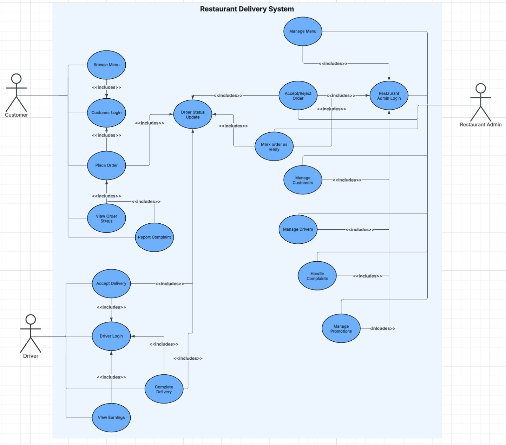
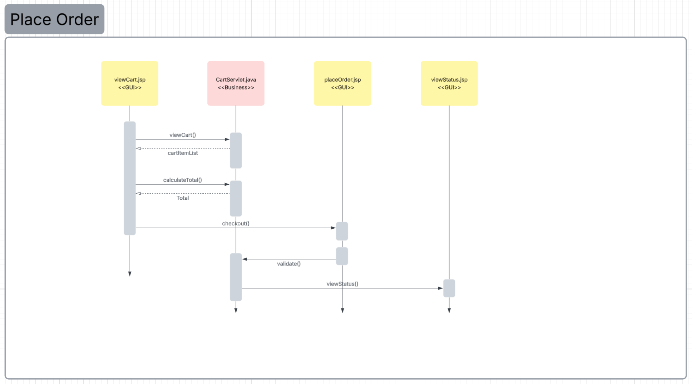

# Restaurant Delivery System

A web-based restaurant ordering and delivery workflow built with n-layered architecture (GUI → Business → Persistence → Helper). Users can log in, browse/search menu items, add items to a cart, place orders, choose a payment method, and view order status.

## Features
- User login flow (login page + login result)
- Browse menu and search menu items
- Add/remove items in cart and view cart total
- Checkout + payment method selection
- Place order and view order status

## Tech Stack
- Java (Servlet/JSP)
- HTML/CSS
- MySQL
- Layered architecture (Business, Persistence, Helper)
- Git/GitHub

## Project Structure
- `Business/` – business logic (order/cart handling, validations, workflows)
- `Persistence/` – database/data access layer (CRUD, queries, storage logic)
- `Helper/` – shared utilities and models (DTOs, helpers, constants)
- `*.jsp / *.html` – UI pages (browse, cart, login, checkout, status)

## Use Case Diagram

## ER Diagram

## Browse Menu Sequence Diagram

## Place Order Sequence Diagram

