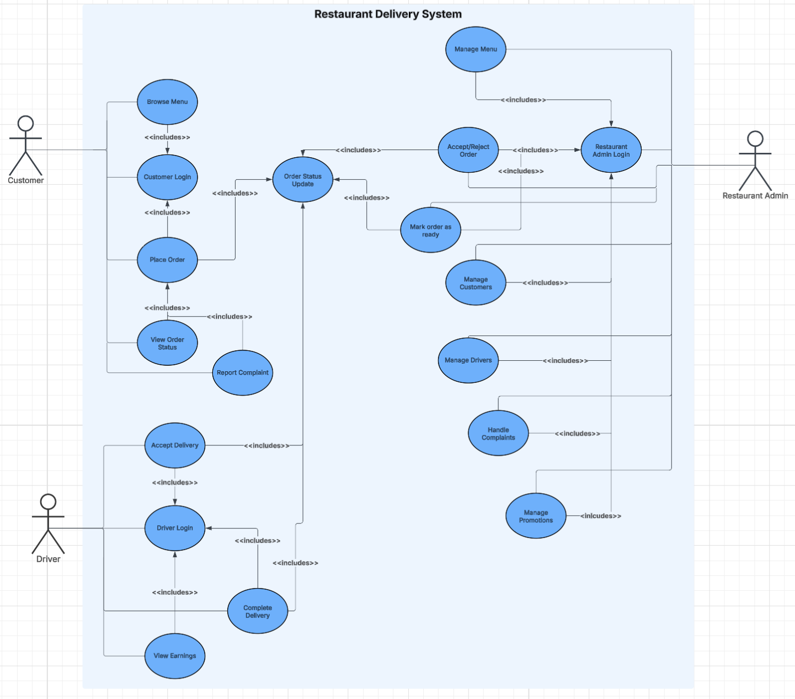
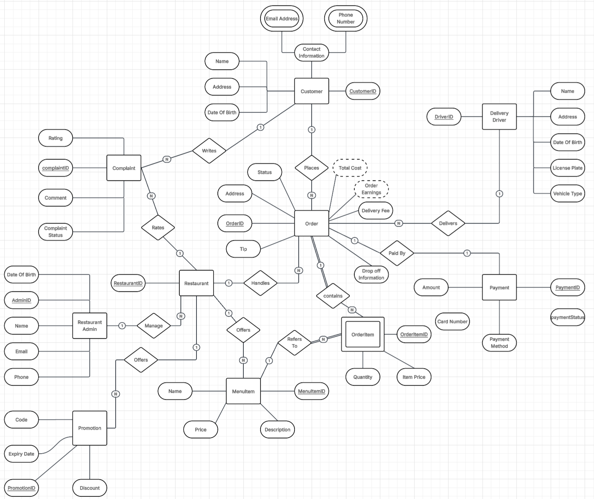
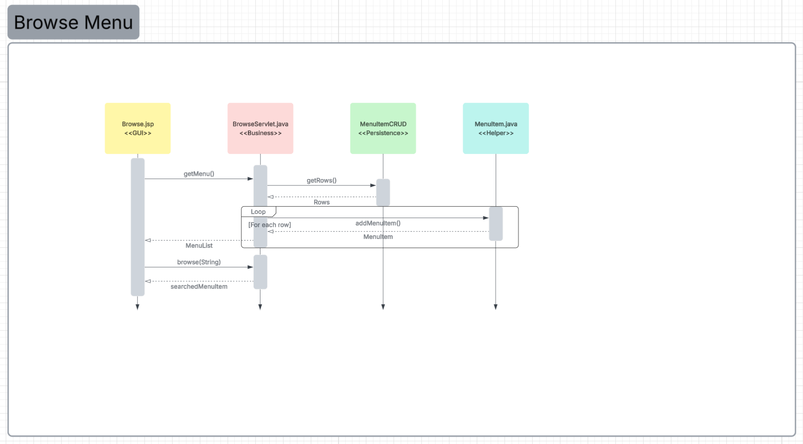
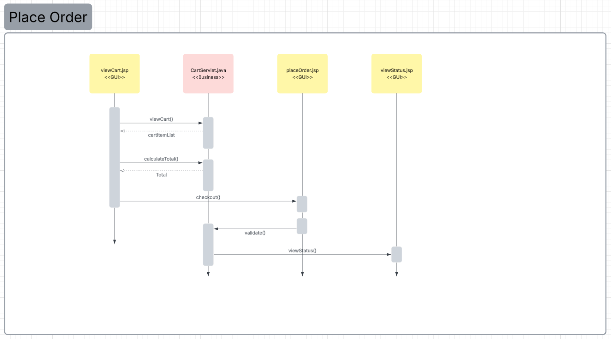

# Restaurant Delivery System

A microservices-based restaurant ordering platform built with Java and deployed on Google Kubernetes Engine (GKE). Users can log in, browse the menu, manage a cart, and place orders — with asynchronous messaging handling order processing between services.

## Architecture

The system is split into four independently deployable services, each with its own responsibility:

```
FrontendService  ──►  MenuService   (Menu_DB)
      │          ──►  CartService   (Menu_DB)
      │          ──►  OrderService
                             ▲
                        KubeMQ Queue
                   (async messaging from CartService)
```

| Service | Description |
|---|---|
| **FrontendService** | Serves the UI — login, menu browsing, cart, and order pages |
| **MenuService** | REST API for retrieving menu items from Menu_DB |
| **CartService** | REST API for cart management; publishes order events to KubeMQ |
| **OrderService** | Consumes KubeMQ messages and processes orders |

## Tech Stack

- **Backend:** Java (Servlet/JSP), REST API
- **Databases:** MySQL — `Users_DB` (authentication), `Menu_DB` (menu & cart)
- **Auth:** JWT Authentication
- **Messaging:** KubeMQ (async queue between CartService and OrderService)
- **Containerization:** Docker
- **Orchestration:** Kubernetes (Google Kubernetes Engine — 3 nodes)
- **Registry:** Docker Hub (`gabtlv/coe692`)

## Getting Started

### Prerequisites

- Java 11+
- Docker
- A running MySQL instance
- A running KubeMQ instance (or KubeMQ cluster)
- (Optional) `kubectl` + GKE cluster for cloud deployment

### Environment Variables

Do not hardcode credentials. Each service expects the following environment variables:

```bash
# Database
DB_HOST=<your-mysql-host>
DB_PORT=3306
DB_USER=<your-db-username>
DB_PASSWORD=<your-db-password>

# JWT
JWT_SECRET=<your-secret-key>

# KubeMQ (OrderService / CartService)
KUBEMQ_ADDRESS=<kubemq-host>:50000
KUBEMQ_CHANNEL=orders
```

Copy `.env.example` to `.env` and fill in your values before running locally.

### Running with Docker

Build and run each service individually:

```bash
# Example for MenuService
cd MenuService
docker build -t menu-service .
docker run -p 8081:8080 --env-file .env menu-service
```

### Deploying to Kubernetes

Apply the manifests for each service:

```bash
kubectl apply -f MenuService/k8s/
kubectl apply -f CartService/k8s/
kubectl apply -f OrderService/k8s/
kubectl apply -f FrontendService/k8s/
```

## Diagrams

### Use Case


### Entity Relationship


### Browse Menu — Sequence


### Place Order — Sequence


## Author

Gab — [github.com/gabtlv](https://github.com/gabtlv)
Leilo — [github.com/janleiloterte]((https://github.com/janleiloterte))
